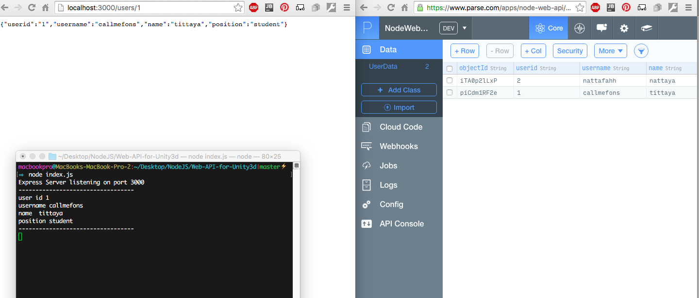
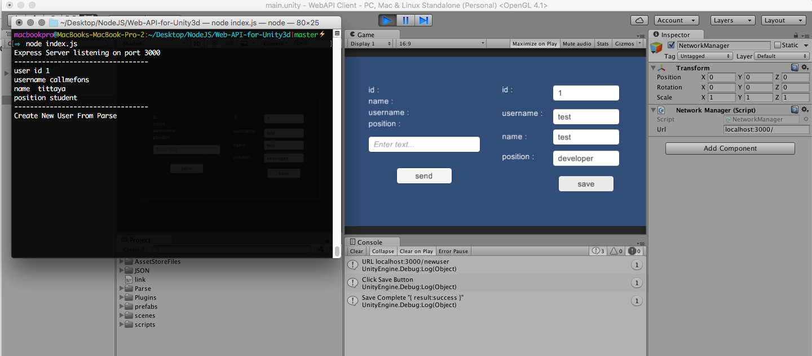

### webapi_unity3d
This just the basics of building a game that allows connecting and usage of REST endpoints. I've used a framework like express to create a Node Server and Parse SDK with Unity

------------------

### Setup

##### Main Repository
1. `git clone git@github.com:nattayamairittha/webapi_unity3d.git`
2. `cd Web-API-for-Unity3d`
3. `copy a directory WebAPI Client to Unity3D Engine`
4. `npm i`
5. `node index.js`

